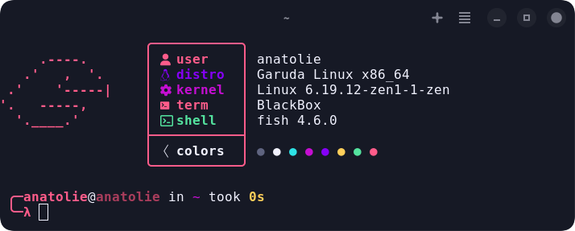

# Sweet for Blackbox

A port of the **Sweet** color scheme by [EliverLara](https://github.com/EliverLara/Sweet) for the Blackbox terminal emulator.

## 🚀 Installation

1. Download the [sweet-blackbox.json](themes/sweet-blackbox.json) file.
2. Open **Blackbox**.
3. Go to **Preferences > Terminal** and scroll down to the **"Theme"** section.
4. Click **Open themes folder**.
5. Copy the `sweet-blackbox.json` file into that folder.
6. Restart Blackbox.
7. Repeat Step 3 and select **Sweet**.

## 🎵 Extra: Cava Theme
I've also included a matching theme for **Cava**.

### Installation:
1. Open your Cava config file (usually `~/.config/cava/config`).
2. Copy the colors from [extra/cava/config](extra/cava/config) into your configuration.
3. Restart Cava.

## 📑 Credits
- Original theme by [EliverLara](https://github.com/EliverLara).
- Ported by [LordBlack006](https://github.com/LordBlack006).

## ⚖️ License
This project is licensed under the GPL-3.0 License.
